# 项目报告：基于多模态数据的皮肤病变智能诊断系统

**数据分析与数据挖掘课程期末项目 · 选项 C：端到端应用系统开发**

|              |                                                                               |
| ------------ | ----------------------------------------------------------------------------- |
| **小组编号** | 20                                                                            |
| **小组成员** | 2252584 欧宇轩 2252752 刘继业 2253377 李航                              |
| **数据集**   | HAM10000（10,015 张皮肤镜图像，7 类病变）                                     |
| **代码仓库** | `2026_Tongji_HAM10000`（https://github.com/salad14/2026_Tongji_HAM10000.git） |

---

## 摘要

皮肤癌是全球最常见的恶性肿瘤之一，早期识别对患者预后具有决定性影响，但皮肤病变的肉眼判读高度依赖医生经验，基层医疗资源相对匮乏。本项目面向公开的 HAM10000 皮肤镜数据集，构建了一个覆盖**数据处理、模型训练、量化评估与交互式演示**全流程的端到端皮肤病变智能诊断系统 SkinSight，实现对 7 类常见皮肤病变——akiec（光化性角化病与上皮内癌）、bcc（基底细胞癌）、bkl（良性角化病样皮损）、df（皮肤纤维瘤）、mel（恶性黑色素瘤）、nv（色素痣）以及 vasc（血管性皮损）的自动分类。

在方法上，本项目以皮肤镜图像与患者结构化元数据（年龄、性别、病灶部位）为输入，设计并对比了三种模型：仅用元数据的多层感知机（`meta_only`）、基于 EfficientNet-B0 迁移学习的纯图像模型（`image_only`），以及融合图像与元数据的多模态后融合模型（`fusion`）。三者构成一组系统性消融实验。为应对类别极度不平衡（最大类 `nv` 占 66.9%，最小类 `df` 仅 1.1%），训练采用类别加权交叉熵损失，并以 **Macro F1** 而非 Accuracy 作为首要选优与评估指标。为避免同一病灶多张图像造成的数据泄漏，数据划分按 `lesion_id` 分组进行。

实验在独立测试集（1,494 张）上的结果表明：纯元数据模型表现有限（Macro F1 = 0.182），纯图像模型大幅提升（Macro F1 = 0.693，Accuracy = 0.815），融合模型在 Accuracy（0.823）、Weighted F1（0.829）与 Macro AUC（0.965）上进一步小幅领先、而 Macro F1 略低于纯图像（0.691）。需要说明的是，上述为单次固定划分、单一随机种子下的实验观察，未进行重复实验与统计显著性检验，因此差异仅反映本次实验情形，不宜推断为稳定增益。最后，本项目基于 Streamlit 构建了包含病变诊断、模型评估、消融实验与数据探索四个功能页面的交互式 Web 系统，并通过统一的推理服务接口接入真实 PyTorch 权重，支持 GPU/CPU 自适应推理，达到"一键运行、实时演示"的交付标准。

**关键词**：皮肤病变分类；HAM10000；多模态融合；迁移学习；类别不平衡；EfficientNet；Streamlit

---

## 1 引言

### 1.1 研究背景与意义

皮肤癌的发病率在全球范围内持续上升，其中黑色素瘤（melanoma）虽占皮肤癌病例比例较低，却造成多数皮肤癌相关死亡。临床实践中，皮肤镜（dermoscopy）是辅助诊断的重要手段，但其判读结果高度依赖医生的专业经验，存在主观性强、基层可及性低等问题。借助数据挖掘与深度学习技术构建计算机辅助诊断（CAD）系统，有望提高诊断的效率与一致性，为基层医疗与教学提供辅助参考。

本项目选择课程任务书中的**选项 C：端到端应用系统开发**，目标是构建一个完整的数据挖掘应用，涵盖数据处理、模型训练、评估与轻量级交互界面。该选题与任务书示例（电影推荐系统、股票情绪分析 Dashboard）在结构上同构，并以医学影像这一高价值场景作为载体，兼具工程完整性与现实意义。

### 1.2 数据集

本项目采用公开的 HAM10000（_Human Against Machine with 10000 training images_）数据集[1]，由维也纳医科大学与澳大利亚昆士兰皮肤科诊所联合收集，包含 10,015 张皮肤镜图像（600×450 像素）及配套结构化元数据（患者年龄、性别、病灶部位、诊断确认方式），覆盖 7 种常见皮肤病变类型，超过 50% 的标注经病理切片确认[1]。数据集遵循 CC BY-NC 4.0 许可，仅限非商业学术用途。7 类病变及其编码如表 1-1 所示。

**表 1-1 HAM10000 七类病变及标签编码**

| 标签 | 缩写    | 英文全称                                        | 中文名称               |
| ---: | ------- | ----------------------------------------------- | ---------------------- |
|    0 | `akiec` | Actinic keratoses and intraepithelial carcinoma | 光化性角化病与上皮内癌 |
|    1 | `bcc`   | Basal cell carcinoma                            | 基底细胞癌             |
|    2 | `bkl`   | Benign keratosis-like lesions                   | 良性角化病变           |
|    3 | `df`    | Dermatofibroma                                  | 皮肤纤维瘤             |
|    4 | `mel`   | Melanoma                                        | 黑色素瘤               |
|    5 | `nv`    | Melanocytic nevi                                | 黑色素细胞痣           |
|    6 | `vasc`  | Vascular lesions                                | 血管性病变             |

### 1.3 主要工作与贡献

本项目的主要工作可概括为以下四点：

1. **数据工程**：构建了从原始数据校验、元数据清洗、缺失值处理到病灶级（lesion-level）数据集划分的完整数据管道，并产出可复用的 PyTorch 数据接口与类别不平衡处理工具。
2. **多模型对比**：实现纯元数据、纯图像、图像+元数据融合三种模型，构成系统性消融实验，从模态贡献角度分析各信息源的作用。
3. **严谨评估**：针对类别不平衡问题，以 Macro F1、Weighted F1、Macro AUC（OvR）与混淆矩阵为多维评估口径，并进行错误分析。
4. **端到端系统**：基于 Streamlit 构建四页面交互系统，通过统一推理服务接口接入真实模型权重，实现一键运行的可视化演示。

### 1.4 报告组织结构

本报告其余部分组织如下：第 2 节简述相关工作；第 3 节介绍数据与预处理；第 4 节阐述系统架构与模型方法；第 5 节给出实验设置与结果；第 6 节进行讨论；第 7 节总结全文。

---

## 2 相关工作

皮肤病变自动分类是医学影像分析的经典任务。早期方法多基于手工特征（颜色、纹理、ABCD 法则）配合传统机器学习分类器；随着深度学习的发展，卷积神经网络（CNN）凭借端到端的特征学习能力成为主流。
在 ISIC[3] / HAM10000[1] 等公开基准上，研究者广泛采用 ResNet、DenseNet、EfficientNet[2] 等骨干网络进行迁移学习，并通过类别加权、重采样、数据增强等手段缓解类别不平衡问题。在多模态方向，Pacheco 与 Krohling[7] 系统比较了多种将患者元数据（年龄、性别、病灶部位等）与皮肤病变图像融合的深度学习方法，报告融合元数据可带来整体性能提升，并指出其增益幅度与数据集类型相关。本项目在方法选型上承袭上述思路：以在 ImageNet[5] 上预训练的 EfficientNet-B0[2] 作为图像骨干，结合元数据分支进行后融合（late fusion），并通过消融实验量化各模态的贡献。
需要说明的是，本项目的目标是课程范畴内的端到端系统实现与模态对比，而非面向临床部署的诊断工具。

---

## 3 数据与预处理

> **【本节需要由组员 1 （数据工程负责人）撰写】**
>
> 本节对应数据工程负责人的核心交付物（数据预处理代码、特征文档、EDA 报告章节）。正文待补，撰写思路与已就绪的图表素材如下，相关实现见 `src/data/`（`check_dataset.py`、`clean_metadata.py`、`make_splits.py`、`dataset.py`）与 `notebooks/01_eda_liujie.ipynb`，并可参考 `docs/feature_engineering_liujiye.md`。

### 3.1 数据完整性校验

### 3.2 元数据清洗与缺失值处理

> 缺失值与字段分布配图：
>
> 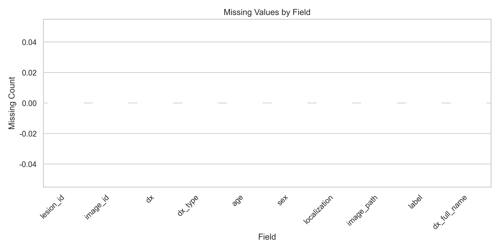
>
> **图 3-1** 清洗后各字段缺失/未知值统计

### 3.3 图像预处理与数据增强

### 3.4 元数据特征工程

### 3.5 类别不平衡分析与处理

### 3.6 探索性数据分析（EDA）

> 下列图表均由 `notebooks/01_eda_liujie.ipynb` 生成并保存于 `reports/figures/`。
>
> 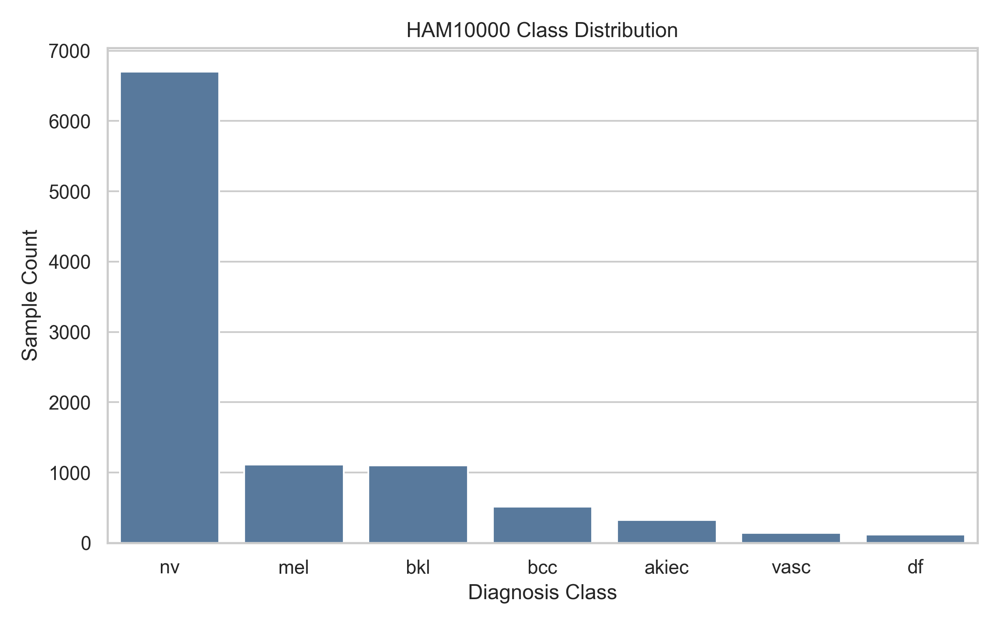 > **图 3-2** HAM10000 类别分布
>
>  > **图 3-3** 各诊断类别样例图像
>
> 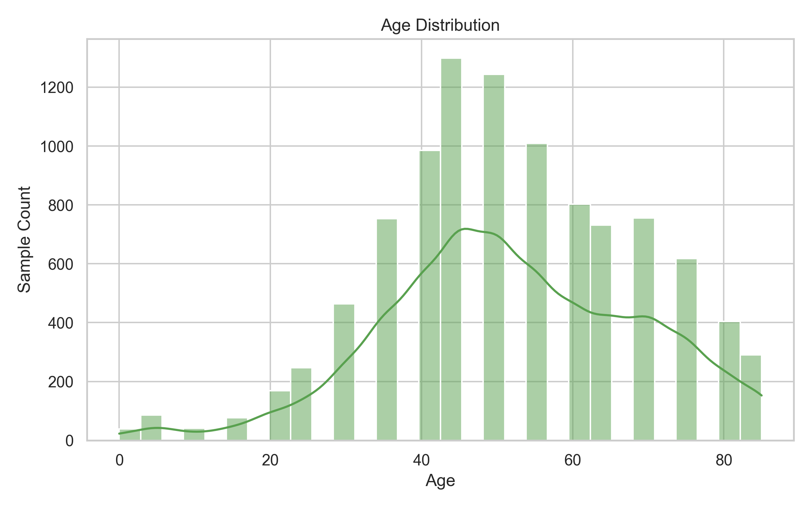 > **图 3-4** 患者年龄分布
>
> 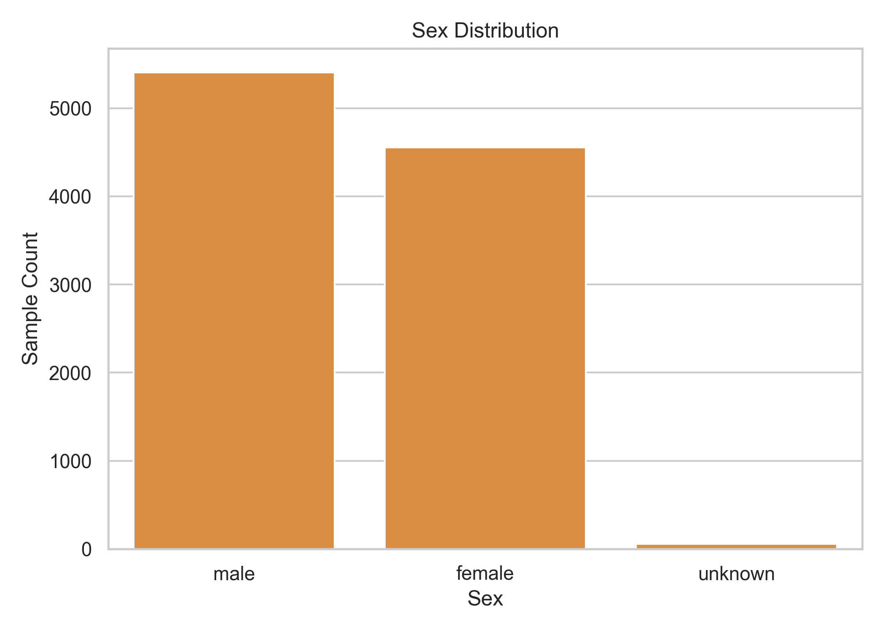 > **图 3-5** 患者性别分布
>
> 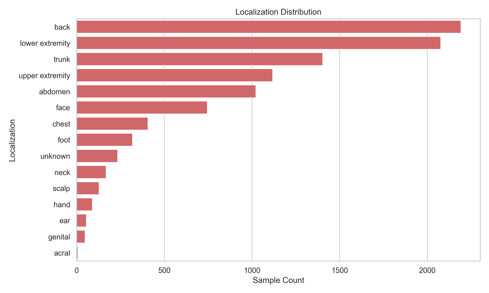 > **图 3-6** 病灶部位分布
>
> 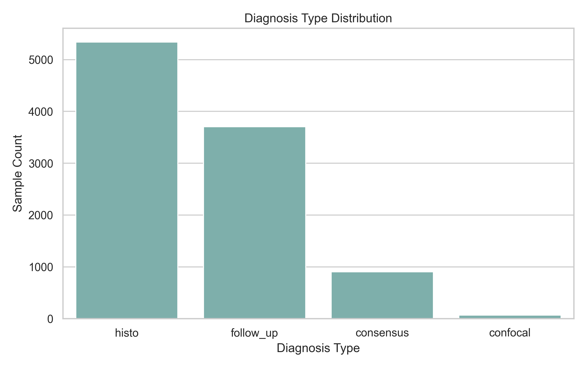 > **图 3-7** 诊断确认方式分布

### 3.7 数据集划分

---

## 4 方法

本节阐述系统的整体架构、三种对比模型的设计、训练策略以及面向应用的推理服务与交互界面设计。

### 4.1 系统总体架构

SkinSight 采用分层的端到端流水线设计，自底向上依次为数据层、模型层、推理服务层与交互展示层，各层职责单一、通过明确的接口解耦，整体结构如下：

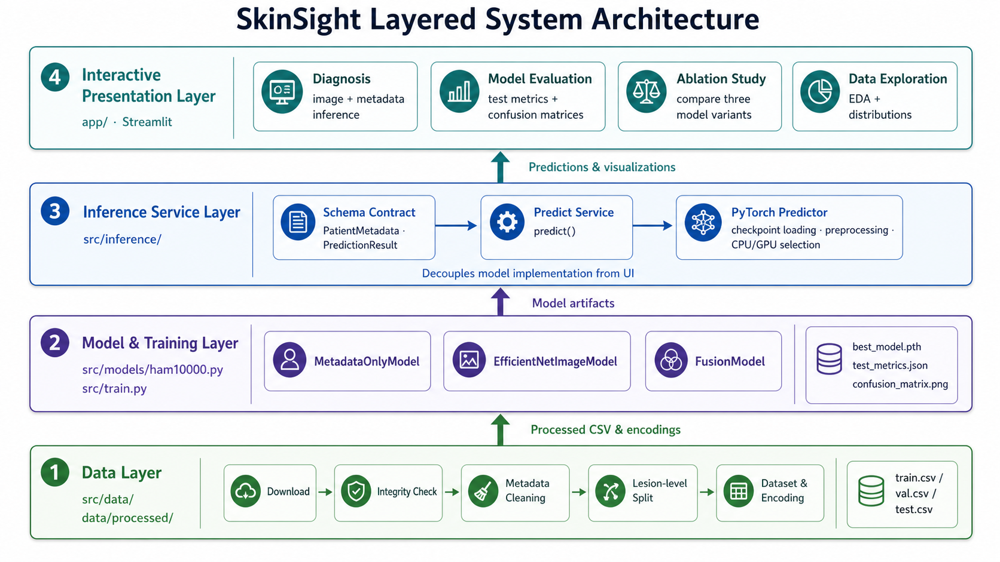

**图 4-1** SkinSight 系统分层架构

该设计的核心理念是**关注点分离**：数据层产出的清洗结果与划分 CSV 可独立交付给模型层；模型层产出的权重（`best_model.pth`）连同元数据编码器、类别顺序等上下文一并保存；推理服务层将"加载权重 + 预处理 + 前向推理 + 结果归一化"封装为统一接口，对上层屏蔽底层细节；展示层则只面向接口编程，不感知模型实现。这一架构使得三人分工可以并行推进、互不阻塞，也便于后续替换模型或前端。

### 4.2 模型设计

> **【本节需要由组员 2 （算法负责人）撰写】**
>
> 本节对应算法负责人的核心交付物（模型训练代码、模型对比分析），实现见 `src/models/ham10000.py`。正文待补

### 4.3 损失函数与训练策略

> **【本节需要由组员 2 欧宇轩（算法负责人）撰写】**
>
> 实现见 `src/train.py`。正文待补

### 4.4 推理服务与契约设计

为支撑前端稳定调用，本项目在 `src/inference/` 中设计了一个**面向契约**的推理服务层，是工程交付的关键部分。其设计要点如下：

- **统一数据契约**（`schema.py`）：定义 `PatientMetadata`（患者元数据）与 `PredictionResult`（预测结果）两个冻结数据类。二者在 `__post_init__` 中执行严格校验——例如年龄须落在 $[0,120]$、性别取值合法、预测概率必须覆盖全部 7 类、非负且**和为 1**（容差 $10^{-6}$）。任何不满足契约的输入或输出都会在进入界面前抛出异常，从而将错误拦截在边界处。
- **适配器模式**（`pytorch_predictor.py`）：`PytorchPredictor` 负责把磁盘上的 `best_model.pth` 还原为可用模型。加载时采用 PyTorch 的安全模式 `weights_only=True`；从 checkpoint 中恢复元数据编码器与图像尺寸；并校验 checkpoint 内置的 `label_names` 与应用约定的类别顺序完全一致，否则拒绝加载。这保证了"训练时的编码规则"与"推理时的编码规则"严格一致。
- **门面与缓存**（`service.py`）：对外仅暴露一个 `predict(image, metadata, variant)` 函数；通过 `lru_cache` 缓存各变体的 predictor，避免在 Streamlit 的脚本重运行机制下重复加载权重。当权重缺失时，抛出可读的 `PredictorNotConfiguredError` 提示。
- **设备自适应**：`select_device()` 在 CUDA 可用时默认使用 GPU（`cuda:0`），否则回退至 CPU，使系统在不同环境下均可运行。

这一层的契约校验同时也是**可测试性**的基础：单元测试 `tests/test_inference_service.py` 通过注入桩 predictor，验证了默认推理路径、权重缺失时的报错路径，以及"概率之和为 1"等契约约束。

### 4.5 交互式系统设计

交互系统基于 Streamlit 实现多页应用，入口为 `app/main.py`，四个功能页位于 `app/pages/`。所有页面共享 `app/ui.py` 提供的统一骨架——`configure_page()`（页面配置与自定义 CSS 主题）、`render_sidebar()`（侧边栏品牌与导航）与 `render_page_header()`（页眉），从而保证整站视觉风格一致（SkinSight 品牌、teal 主色调、卡片式布局）。四个页面的职责见表 4-1。

**表 4-1 交互系统功能页面**

| 页面     | 文件                    | 功能                                                                                                                     |
| -------- | ----------------------- | ------------------------------------------------------------------------------------------------------------------------ |
| 病变诊断 | `1_diagnosis.py`        | 上传图像 + 填写元数据 + 选择推理分支，输出七分类概率与最高概率类别，并以横向条形图可视化各类别的模型输出概率（未经校准） |
| 模型评估 | `2_model_evaluation.py` | 读取 `outputs/*/test_metrics.json` 与混淆矩阵，集中展示三组实验的测试集指标与误差结构                                    |
| 消融实验 | `3_ablation_study.py`   | 对同一病例并行运行 `image_only` / `meta_only` / `fusion` 三个分支，并排比较模态贡献                                      |
| 数据探索 | `4_eda.py`              | 读取处理后 CSV 与 EDA 图表，展示样本规模、类别分布与元数据特征，不依赖原始图片目录                                       |

系统首页以功能卡片形式概览四大模块，并实时显示当前推理设备，如图 4-2 所示。

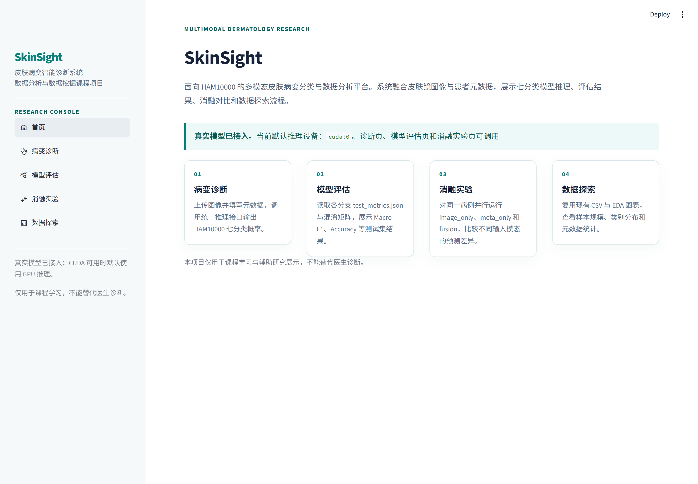
**图 4-2** SkinSight 系统首页

---

## 5 实验

### 5.1 实验设置

**实验环境**：模型训练与推理在配备 NVIDIA GPU 的本机环境完成，PyTorch 2.12（CUDA 12.6），Python 3.10，conda 环境名 `skinsight`。主要依赖见 `requirements.txt`（PyTorch、torchvision、albumentations、scikit-learn、Streamlit 等）。

**数据划分**：按 `lesion_id` 分组划分为训练集 7,002、验证集 1,519、测试集 1,494，三集病灶互不重叠。所有指标均在**独立测试集**上报告。

**评估指标**：针对类别不平衡，采用以下多维指标（其中 $\text{TP}_c$、$\text{FP}_c$、$\text{FN}_c$ 为类别 $c$ 的混淆计数）：

- **Accuracy**：整体准确率，$ \text{Acc} = \dfrac{\sum_c \text{TP}\_c}{N} $。受多数类主导，仅作参考。
- **Macro F1**（首要指标）：各类 F1 的非加权平均，平等对待每个类别：
  $$ \text{Precision}_c = \frac{\text{TP}\_c}{\text{TP}\_c+\text{FP}\_c},\quad \text{Recall}\_c = \frac{\text{TP}\_c}{\text{TP}\_c+\text{FN}\_c} $$
$$ \text{F1}_{\text{macro}} = \frac{1}{K}\sum\_{c=1}^{K} \frac{2\,\text{Precision}\_c\,\text{Recall}\_c}{\text{Precision}\_c+\text{Recall}\_c} $$
- **Weighted F1**：按各类样本数加权的 F1 平均，反映整体表现。
- **Macro AUC（OvR）**：以 One-vs-Rest 方式计算每类 ROC 曲线下面积后取宏平均，衡量概率排序质量。

### 5.2 消融实验结果

本节通过三组消融实验，比较图像与元数据各自及其组合对分类性能的影响。三组实验共享相同的数据划分、学习率、训练轮数、优化器与类别加权策略，主要差异在于输入模态及与之对应的模型结构。需要指出，三组的网络容量并不相同，且批大小（`meta_only` 128 / `image_only` 32 / `fusion` 24）与是否启用混合精度（仅图像、融合启用 AMP）等配置也存在差异，同时未进行多随机种子重复实验；因此本实验支持"不同模型与输入方案的性能比较"，但不作严格的因果归因。三组在独立测试集（1,494 张）上的整体指标如表 5-1 所示。

**表 5-1 三组消融实验测试集指标**

| 实验组       | 输入模态      |   Accuracy |   Macro F1 | Weighted F1 | Macro AUC (OvR) |
| ------------ | ------------- | ---------: | ---------: | ----------: | --------------: |
| `meta_only`  | 仅元数据      |     0.3494 |     0.1818 |      0.4313 |          0.7409 |
| `image_only` | 仅图像        |     0.8146 | **0.6932** |      0.8205 |          0.9621 |
| `fusion`     | 图像 + 元数据 | **0.8226** |     0.6914 |  **0.8286** |      **0.9652** |

**（1）元数据是弱信息源，单独不足以支撑诊断。** `meta_only` 模型的 Macro F1 仅为 0.182，Accuracy 0.349 甚至明显低于"全部预测为多数类 `nv`"的朴素基线（0.667）。其 Macro AUC 为 0.741，说明年龄、性别、病灶部位对类别仍带有微弱的区分性先验，但远不足以完成可靠的七分类——这与临床认知一致：结构化元数据只能提供流行病学层面的倾向，无法刻画病灶本身的形态学特征。

**（2）图像是主导信息源。** 仅引入皮肤镜图像后，`image_only` 模型的各项指标发生量级跃升：Macro F1 由 0.182 提升至 0.693（+0.511），Accuracy 由 0.349 提升至 0.815，Macro AUC 达到 0.962。这表明病变的视觉形态是分类决策的核心依据，基于 ImageNet 预训练的 EfficientNet-B0 迁移学习能够有效捕获皮肤镜图像的判别性特征。

**（3）融合元数据带来小幅、方向不一的整体变化。** 相比纯图像模型，`fusion` 模型在 Accuracy（+0.0080）、Weighted F1（+0.0081）与 Macro AUC（+0.0031）三项上取得小幅提升，而 Macro F1 略有下降（−0.0018）。这些差异幅度很小，且如前所述未经重复实验与显著性检验，只能视为本次实验中的观察，不能据此断言融合一定带来稳定增益。这一"加权指标上升、宏平均指标微降"的现象并非矛盾，其机制可由表 5-2 的各类别 F1 分解揭示。

**表 5-2 三组模型各类别 F1 对比（按支持数排序）**

| 类别           | 测试支持数 | `meta_only` | `image_only` |  `fusion` | fusion−image |
| -------------- | ---------: | ----------: | -----------: | --------: | -----------: |
| nv             |        996 |       0.561 |        0.904 | **0.912** |       +0.008 |
| mel            |        187 |       0.087 |        0.605 |     0.604 |       −0.001 |
| bkl            |        152 |       0.366 |        0.672 | **0.708** |       +0.036 |
| bcc            |         68 |       0.082 |        0.735 | **0.757** |       +0.022 |
| akiec          |         63 |       0.114 |        0.626 |     0.585 |       −0.041 |
| vasc           |         21 |       0.031 |        0.776 | **0.857** |       +0.081 |
| df             |          7 |       0.033 |        0.533 |     0.417 |       −0.116 |
| **Macro 平均** |          — |   **0.182** |    **0.693** | **0.691** |       −0.002 |

> 注：表 5-2 各类别 F1 由对应混淆矩阵（图 5-1~5-3）反算得到，其 Macro 平均与表 5-1 的 Macro F1 完全一致（0.182 / 0.693 / 0.691），可作为数据自洽性的交叉验证。

由表 5-2 可见，融合元数据后，**样本量较大的 `nv`、`bkl`、`bcc` 以及部位/年龄先验明显的 `vasc` 的 F1 均有提升**，这拉高了由样本量加权的 Accuracy 与 Weighted F1；但**极少数类 `df`（支持数仅 7）与 `akiec` 的 F1 反而下降**，由于 Macro F1 对每个类别等权，少数类的波动被放大，最终抵消了多数类的变化，使 Macro F1 表现为略降。换言之，本次实验中元数据的辅助作用主要体现在中高频类别上，对极少数类未见一致改善；考虑到 `df`、`vasc` 测试支持数仅 7、21，其单类指标本身方差很大（见 5.3），这一对比应谨慎解读。

**结论**：综合来看，图像模态贡献了绝大部分判别能力，元数据在本次实验中起到有限的辅助作用。需要特别说明的是，若**严格按照项目预设的首要指标 Macro F1，纯图像模型（0.6932）略优于融合模型（0.6914）**；系统最终默认采用 `fusion` 模型，并非按首要指标择优的结果，而是综合考虑其在 Accuracy、Weighted F1、Macro AUC 三项整体指标上最优、在 `mel`（黑色素瘤）类上的查全率不低于纯图像（详见 5.3），以及多模态输入对系统演示价值后的**工程决策**。两个模型在主指标上的差距很小，实际选型可按部署目标进一步权衡。

### 5.3 混淆矩阵与错误分析

为进一步剖析模型的误差结构，本节对三组模型的混淆矩阵（图 5-1~5-3，行为真实类别 True、列为预测类别 Predicted）进行分析。混淆矩阵不仅给出整体正确率，更揭示了"错误流向"——即各类别具体被误判为何种类别，这对医学诊断场景的风险评估尤为重要。

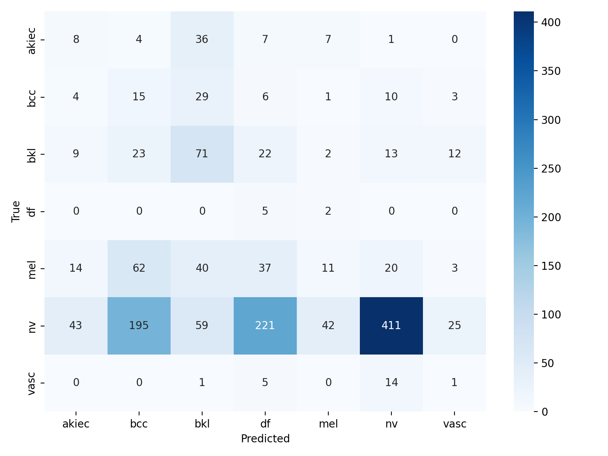
**图 5-1** `meta_only` 测试集混淆矩阵

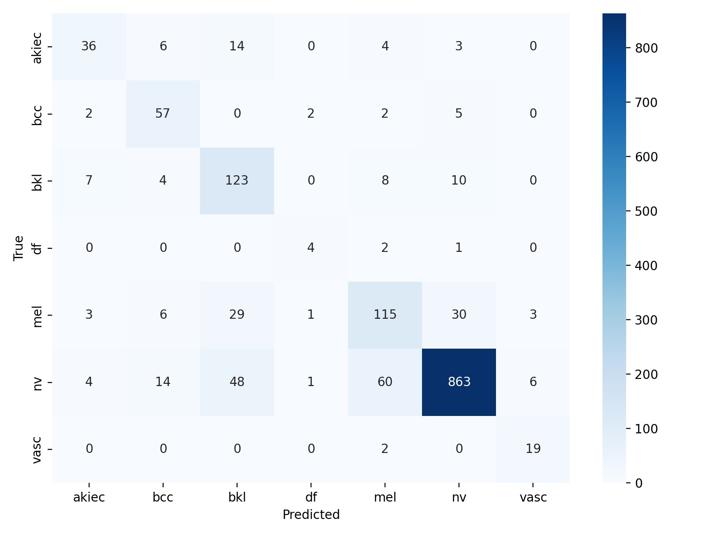
**图 5-2** `image_only` 测试集混淆矩阵

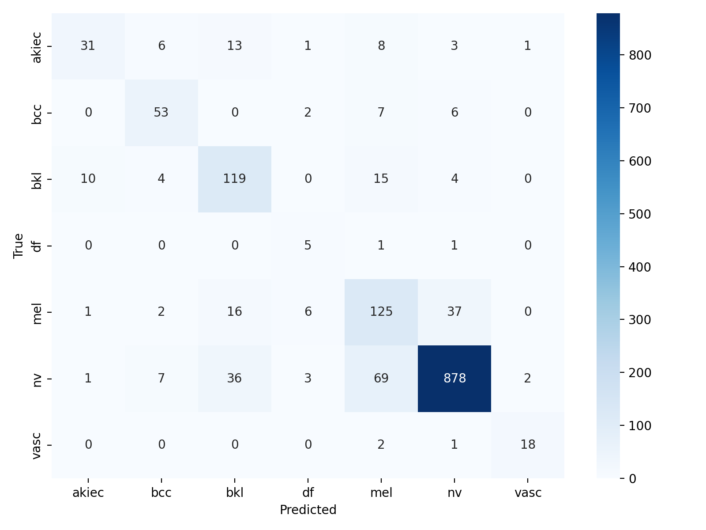
**图 5-3** `fusion` 测试集混淆矩阵

**（1）纯元数据模型的预测坍缩。** 由图 5-1 可见，`meta_only` 的预测严重发散且偏向少数错误模式：真实为 `nv` 的 996 个样本中仅 411 个被正确识别，其余被大量误判为 `df`（221 个）、`bcc`（195 个）等；而真实为 `mel` 的 187 个样本仅 11 个被正确预测（召回 5.9%）。这印证了 5.2 的结论——脱离图像后，元数据在类别间高度重叠，模型无法形成稳定的决策边界。后续分析聚焦于 `image_only` 与 `fusion` 两个有实用价值的模型。

**（2）融合模型的逐类查准/查全。** 表 5-3 给出 `fusion` 模型各类别的 Precision、Recall 与 F1（由图 5-3 计算）。

**表 5-3 `fusion` 模型各类别查准率/查全率/F1**

| 类别  | 支持数 | Recall（查全率） | Precision（查准率） |    F1 |
| ----- | -----: | ---------------: | ------------------: | ----: |
| akiec |     63 |            0.492 |               0.721 | 0.585 |
| bcc   |     68 |            0.779 |               0.736 | 0.757 |
| bkl   |    152 |            0.783 |               0.647 | 0.708 |
| df    |      7 |            0.714 |               0.294 | 0.417 |
| mel   |    187 |            0.668 |               0.551 | 0.604 |
| nv    |    996 |            0.882 |               0.944 | 0.912 |
| vasc  |     21 |            0.857 |               0.857 | 0.857 |

可见多数类 `nv` 同时具有高查全（0.882）与高查准（0.944），是模型表现最稳健的类别；而 `df` 虽召回 0.714，但查准率仅 0.294——因为它支持数仅 7，少量其它类别样本被误判为 `df` 即可明显拉低其查准率，这类极少数类的指标统计上极不稳定，单个样本的预测变化即可大幅改变其 Recall 与 F1，故对 `df`、`vasc` 的单类指标不宜作过强结论，更严谨的做法是配合 bootstrap 置信区间评估其不确定性。

**（3）高频误分类对及其临床意义。** 综合图 5-2、5-3，主要的误分类集中在以下视觉相似的类别对：

- **`mel` ↔ `nv`（黑色素瘤 ↔ 色素痣）**：这是最关键的混淆对。在 `fusion` 模型中，有 37 个真实 `mel` 被误判为 `nv`（**假阴性，即漏诊黑色素瘤**），同时 69 个 `nv` 被误判为 `mel`（假阳性）。二者在皮肤镜下均表现为色素性病变、形态高度相似，是该任务公认的难点。值得注意的是，`fusion` 对 `mel` 的查全率（0.668）略高于 `image_only`（0.615），即融合元数据在本测试集上**减少了一部分黑色素瘤漏分类**——这是就本测试集而言的一项风险相关正向观察，但能否推广到真实临床仍需外部数据与前瞻性验证。
- **`bkl` ↔ `mel` / `akiec`（良性角化 ↔ 黑色素瘤/日光性角化）**：`bkl` 与角化、色素类病变在纹理上相近，`fusion` 中有 15 个 `bkl` 误判为 `mel`、10 个误判为 `akiec`；反向亦有 `mel`、`akiec` 误入 `bkl`。
- **`akiec` 的低召回**：`akiec` 查全率仅 0.492，近半数被分散误判为 `bkl`（13 个）、`mel`（8 个），是七类中召回最低者，反映其与其它角化/肿瘤类病变的形态边界模糊。

**（4）类别不平衡与视觉相似性的共同作用。** 上述错误结构可归因于两方面：其一，**类别不平衡**使模型对多数类 `nv` 的决策更自信，少数类（`df`、`vasc`、`akiec`）在特征空间易被多数类"吸收"；其二，**皮肤镜图像的视觉相似性**导致 `mel`/`nv`、`bkl`/`akiec` 等病理不同但外观相近的类别难以区分。尽管已采用类别加权损失部分缓解了不平衡（使 `vasc`、`df` 等小类仍保有一定召回），但黑色素瘤的漏诊问题仍是后续工作（如引入 Focal Loss、代价敏感学习或针对 `mel` 的难例挖掘）的重点改进方向。

### 5.4 系统运行演示

为验证系统的端到端可用性，本节展示在真实模型权重下的实际运行效果。图 5-4 为病变诊断页：用户填写患者元数据（年龄 50、女性、背部）并选择推理分支后，系统调用真实 PyTorch 模型输出七分类概率，并以横向条形图高亮最高概率类别；页脚标注推理提供者（`pytorch-cuda`）与所用分支，便于核验。图 5-5 为模型评估页，集中呈现三组指标表与融合模型混淆矩阵。

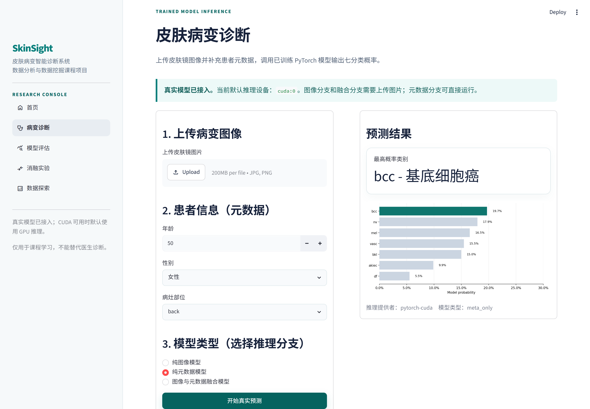
**图 5-4** 病变诊断页：真实模型推理输出七分类概率

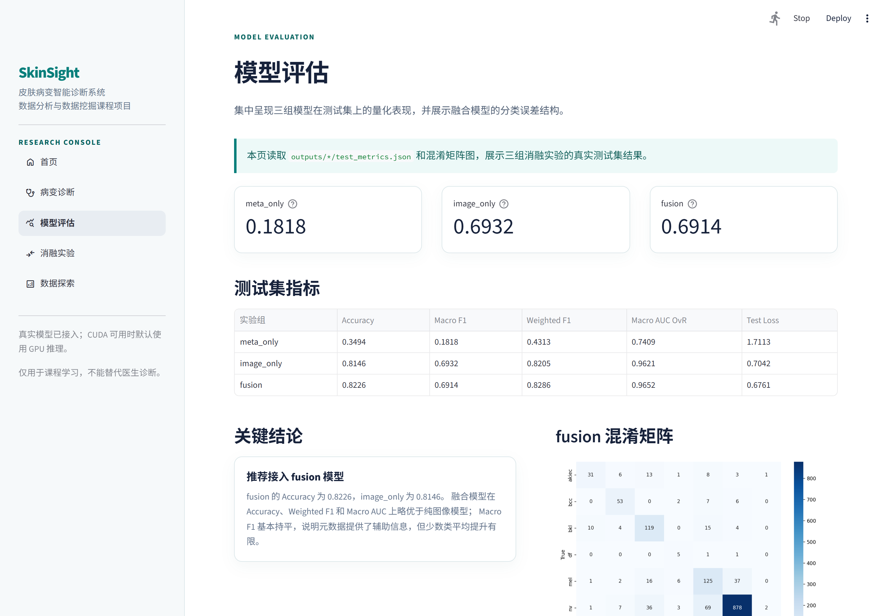
**图 5-5** 模型评估页：三组指标表与混淆矩阵

经实际运行核验，四个页面均可正常渲染与交互，诊断/消融页可在 GPU 上实时完成推理，数据探索与模型评估页可正确读取仓库内的 CSV、JSON 与图表，系统达到"一键运行、实时演示"的交付要求。

---

## 6 讨论

**模态贡献与系统选型**。实验结果刻画了各模态的作用边界：图像是分类的主导信息源，元数据单独使用价值有限，在本次实验中与图像融合后带来 Accuracy、Weighted F1 与 AUC 上的小幅提升（幅度均小于 0.01，且未经重复实验与显著性检验，详见局限性）。这与临床直觉一致——患者年龄、部位等信息对某些病变具有先验提示作用，但不足以替代影像本身。因此系统默认接入融合模型是一项综合工程权衡而非按首要指标择优的结果。

**类别不平衡的影响**。尽管采用了类别加权损失，少数类（`df`、`vasc`）的样本量极小（百余张），其可靠识别仍是难点，这也是 Macro F1 明显低于 Accuracy 的重要原因之一。这提示在医学场景中以 Macro F1 与类别召回为评估重点的必要性。

**训练动态与过拟合**。从训练历史看，图像模型与融合模型在后期均出现明显的训练/验证性能差距：`image_only` 的最佳验证 Macro F1 为 0.7255（第 19 轮），但训练至第 30 轮时训练集 Macro F1 升至 0.8604、验证集回落至 0.6295；`fusion` 的最佳验证 Macro F1 为 0.7235（第 22 轮），第 30 轮训练/验证 Macro F1 分别为 0.9122 / 0.6742。这表明 30 轮训练已进入过拟合区间。本项目采用"按最佳验证 Macro F1 保存 checkpoint"的策略进行测试，做法正确，有效规避了过拟合末期的权重；但更稳健的训练应引入早停、更强的正则化或增强、以及多次训练取平均，以缩小该差距并降低单次训练的偶然性。

**方案演进说明**。需要指出，最终实现与初期计划书相比有两处务实调整：其一，类别不平衡处理由计划中的 SMOTE 过采样改为**类别加权交叉熵 + 可选加权采样器**——SMOTE 在原始像素图像上做插值并不适宜，加权策略对图像任务更稳健；其二，图像骨干直接采用 `torchvision` 的 EfficientNet-B0 实现而非额外引入 `timm` 库，以减少依赖、便于一键部署。两处调整均不影响整体技术路线。

**局限性**。本项目作为课程范畴的端到端系统实现，存在以下需明确披露的局限：

1. **评估证据强度有限**：所有结果仅基于 HAM10000 的一次固定划分与单一随机种子，未进行重复实验、置信区间估计或统计显著性检验，也未在外部数据集上做独立验证或前瞻性验证。因此模型间的细小差异（尤其 `fusion` 与 `image_only` 之间）只能视为本次实验的观察，不代表统计意义上的稳定结论。
2. **轻微预处理统计量泄漏**：数据流水线已按 `lesion_id` 分组划分，避免了同一病灶的多张图像跨训练/验证/测试集泄漏；但 `age` 缺失值的中位数是在划分前的全量清洗阶段计算的，使训练预处理间接使用了验证/测试集的年龄统计。该问题仅涉及单一简单统计量、预计影响有限，但更严格的流程应仅在训练集上拟合填充值再应用于其它集合与推理端。
3. **输出概率未校准**：系统展示的七分类概率由 softmax 直接产生，未进行温度缩放等校准，也未评估可靠性图、ECE 或 Brier 分数。高概率不等同于真实疾病发生概率或临床置信度。
4. **少数类指标不确定性大**：`df`、`vasc` 测试支持数仅 7、21，其单类 Recall/F1 方差很大，相关结论应谨慎，宜配合 bootstrap 置信区间。
5. **方法与交互的简化**：未引入更强的重采样或损失（如 Focal Loss、代价敏感学习）；融合方式为简单的特征拼接后融合，未探索注意力等更复杂的跨模态交互。
6. **用途边界**：本系统为课程演示性质的辅助分类系统，**不能替代专业医生的诊断**，任何真实医学判断均应由专业医生完成。

需要补充的是，面向医疗影像 AI 的研究通常应参照 CLAIM[8]（医学影像人工智能报告清单）与 TRIPOD+AI[9]（含机器学习的诊断/预测模型透明报告规范）等指南，对数据划分、缺失值处理、模型选择、内部与外部验证、性能不确定性与适用范围进行规范化披露；受课程篇幅与数据条件所限，本项目仅在上述局限性中作了简化说明，未来工作可据此进一步完善。

> **可补充视角**：数据工程负责人（组员 1）可从数据质量与标注确认方式角度补充讨论；算法负责人（组员 2）可在 4.3 节补充超参敏感性等进一步分析。

---

## 7 结论与展望

本项目围绕 HAM10000 数据集，完成了一个覆盖数据处理、模型训练、量化评估与交互演示的端到端皮肤病变分类系统。通过纯元数据、纯图像与多模态融合三组消融实验，量化了各信息源在本次实验中的贡献：图像模态主导分类性能（Macro F1 0.69、AUC 0.96），融合元数据后在 Accuracy、Weighted F1、AUC 三项整体指标上获得小幅提升（融合模型 Accuracy 0.823、AUC 0.965），而首要指标 Macro F1 与纯图像基本持平。在工程层面，本项目以面向契约的推理服务层解耦模型与界面，构建了风格统一、一键运行的 Streamlit 四页面系统，达到了选项 C 对端到端应用系统的完整性要求。

需强调，上述结论基于单次固定划分实验、未经显著性检验与外部验证，模型输出概率亦未校准，系统仅供课程学习与演示。未来可从以下方向改进：引入早停与更强正则化以缓解过拟合；采用重复实验与置信区间/显著性检验以增强结论强度；引入 Focal Loss 或更精细的重采样以提升少数类召回；探索基于注意力的跨模态融合；并在更大规模、多中心数据上开展外部验证以评估泛化能力。

---

## 参考文献

[1] Tschandl P, Rosendahl C, Kittler H. The HAM10000 dataset, a large collection of multi-source dermatoscopic images of common pigmented skin lesions. _Scientific Data_, 2018, 5: 180161.

[2] Tan M, Le Q V. EfficientNet: Rethinking Model Scaling for Convolutional Neural Networks. _Proceedings of the 36th International Conference on Machine Learning (ICML)_, 2019: 6105–6114.

[3] Codella N C F, Gutman D, Celebi M E, et al. Skin Lesion Analysis Toward Melanoma Detection: A Challenge at the 2017 ISBI, Hosted by the International Skin Imaging Collaboration (ISIC). _IEEE International Symposium on Biomedical Imaging (ISBI)_, 2018.

[4] Loshchilov I, Hutter F. Decoupled Weight Decay Regularization. _International Conference on Learning Representations (ICLR)_, 2019.

[5] Deng J, Dong W, Socher R, et al. ImageNet: A Large-Scale Hierarchical Image Database. _IEEE Conference on Computer Vision and Pattern Recognition (CVPR)_, 2009: 248–255.

[6] Buslaev A, Iglovikov V I, Khvedchenya E, et al. Albumentations: Fast and Flexible Image Augmentations. _Information_, 2020, 11(2): 125.

[7] Pacheco A G C, Krohling R A. The impact of patient clinical information on automated skin cancer detection. _Computers in Biology and Medicine_, 2020, 116: 103545.

[8] Mongan J, Moy L, Kahn C E Jr. Checklist for Artificial Intelligence in Medical Imaging (CLAIM): A Guide for Authors and Reviewers. _Radiology: Artificial Intelligence_, 2020, 2(2): e200029.

[9] Collins G S, Moons K G M, Dhiman P, et al. TRIPOD+AI statement: Updated guidance for reporting clinical prediction models that use regression or machine learning methods. _BMJ_, 2024, 385: e078378.
